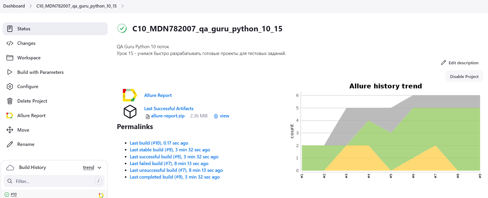
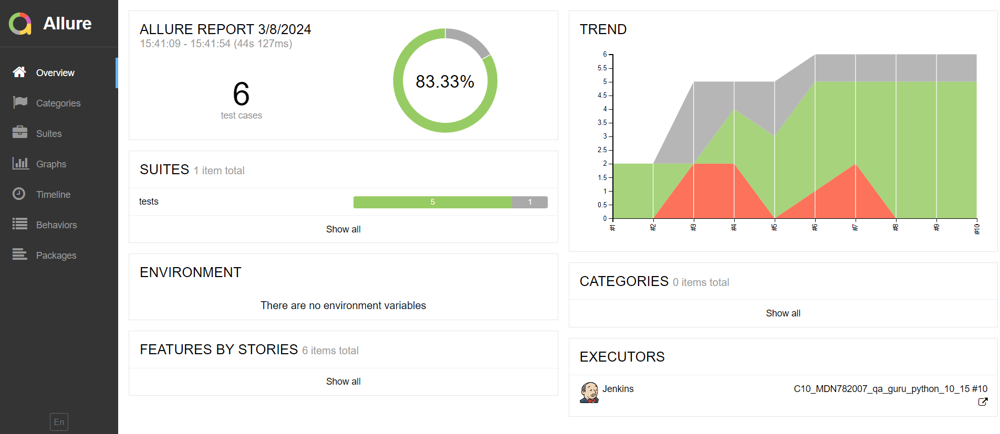
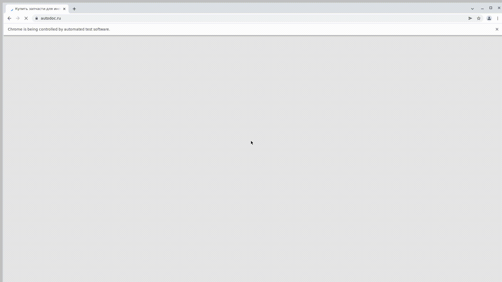

# Проект по тестированию сервиса поиска и подбора автозпчастей "Автодок"    

----
> [Сайт Автодок.ру](https://www.autodoc.ru/)   
> 
  
----
## Список проверок, реализованных в автотестах:  

### UI автотесты:  
- [x] Проверка формы авторизации на сайте
- [x] Авторизация пользователя на сайте (в процессе доработки)  
- [x] Авторизация незарегестрированнного пользователя
- [x] Проверка загрузки главной страницы сайта
- [x] Поиск автозапчасти по номеру
- [x] Поиск каталога по VIN номеру автомобиля

----
### Проект реализован с использованием:  
<p  align="left">
<code></code>
<code></code>
<code></code>
<code></code>
<code></code>
<code></code>
<code></code>
<code></code>
<code></code>  

> Для полноценного прохождения всех тестов должен быть или тестовый аккаунт на сайте ***Автодок*** или реальный, данные которого нужно будет указывать в файле
`.env`  
> 
Для написания UI-тестов используется фреймворк `Selene`, современная «обёртка» вокруг `Selenium WebDriver`
Библиотека модульного тестирования: `PyTest`  
`Jenkins` выполняет удаленный запуск тестов в графическом интерфейсе. Установки дополнительных приложений на компьютер пользователя не требуется.  
`Selenoid` запускает браузер с тестами в контейнерах `Docker` (и записывает видео)  
Фреймворк `Allure Report` собирает графический отчет о прохождении тестов  
После завершения тестов `Telegram Bot` отправляет в `Telegram` краткий вариант `Allure Report`  

----
### Локальный запуск  
Необходимо создать файл `.env` и заполнить его актуальными тестовыми параметрами.  
Пример заполнения файла указан в файле `.env.example`

Для локального запуска необходимо выполнить команду в терминале:  
```commandline
pytest
```
Выполнить запрос на формирование отчета  
note: команда для Windows  
```commandline
allure serve
```

Результат: откроется страница с отчетом Allure Report


----

###  Удаленный запуск автотестов выполняется на сервере Jenkins  
> <a target="_blank" href="https://jenkins.autotests.cloud/job/C10_MDN782007_qa_guru_python_10_15/">Ссылка на проект в Jenkins</a>

----
### Параметры сборки:

`ENVIRONMENT` - определение среды сборки, по умолчанию `PROD`  
`BROWSER NAME` - выбор браузера  
`BROWSER VERSION` - выбор версии браузера. По умолчанию выбран браузер Chrome, версия 100  
`COMMENT` - комментарий для получателя уведомления в Телеграмм  

Версии браузеров, используемые в данной сборке в `Jenkins` и `Selenoid`:  

| Chrome | Firefox |
|--------|---------|
| 100.0  | 98.0    |
| 99.0   | 97.0    |

#### Для запуска автотестов в Jenkins

1. Открыть <a target="_blank" href="https://jenkins.autotests.cloud/job/C10_MDN782007_qa_guru_python_10_15/">проект</a>
2. Выбрать пункт `Build with Parameters`
3. Выбрать браузер
4. Выбрать версию браузера
4. Указать комментарий для уведомления в Телеграмм
5. Нажать кнопку `Build`
6. Результат запуска сборки можно посмотреть в отчёте Allure



----
###  Allure отчет  



Видеопример прохождения теста:  
  


